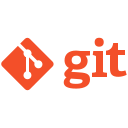
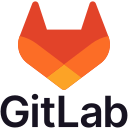

# Привет, я Артём 👋

Я, QA engineer с солидным опытом ручного тестирования, который активно осваивает мир автоматизации.  
За годы работы я накопил глубокое понимание процессов разработки, что позволяет мне качественно находить и документировать дефекты.  
Сейчас я делаю акцент на создании надежных автотестов для веб-приложений, и мобильных приложений на Android и iOS, а также имею базовый опыт нагрузочного тестирования через JMeter.

## Мой технологический стек

  
  
  
  
  
  
  
  
  
  
  
  

## Обо мне

- **Ручное тестирование:** Многолетний опыт качественного ручного тестирования, позволяющий точно выявлять и документировать дефекты.
- **Автоматизация:** Создание стабильных автотестов для веб-приложений с использованием Python, Selenium и Pytest.
- **Мобильное тестирование:** Изучаю автотестирование мобильных приложений на Android и iOS с использованием Appium.
- **Нагрузочное тестирование:** Базовый опыт проведения нагрузочного тестирования с использованием JMeter и мониторинга метрик через Grafana.
- **Аналитический подход:** Глубоко анализирую процессы разработки и тестирования, чтобы каждый проект становился лучше благодаря своевременному обнаружению ошибок.
- **Постоянное развитие:** Регулярно изучаю новые инструменты и технологии, совершенствуя свои навыки и адаптируясь к современным требованиям отрасли.
  

## 📚 Статьи на Хабре

- [Как я научился анализировать собственные собесы с помощью Whisper (и почему это нужно каждому айтишнику и не только)](https://habr.com/ru/articles/910246/)

## Контакты

- **LinkedIn:** [krivoshein-artem](https://www.linkedin.com/in/krivoshein-artem/)
- **Email:** [krivo6ein@gmail.com](mailto:krivo6ein@gmail.com)
- **Резюме:** [hh.kz](https://hh.kz/resume/1193a03eff08968eb80039ed1f775976333743) | [Хабр Карьера](https://career.habr.com/artemkqa)
